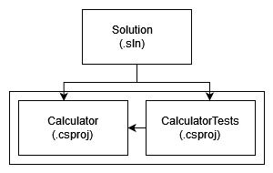

# DIO - Trilha .NET - Trabalhando com Desenvolvimento Orientado a Testes
www.dio.me

## Projeto
Calculadora básica que realiza operações de Adição, Subtração, Divisão e Multiplicação e possibilita a visualização do histórico de operações. Feita com a abordagem TDD (Desenvolvimento Orientado a Testes) utilizando o framework xUnit e a biblioteca Moq para a realização de testes unitários.

## Estrutura do Projeto
O projeto está estruturado da seguinte forma:

